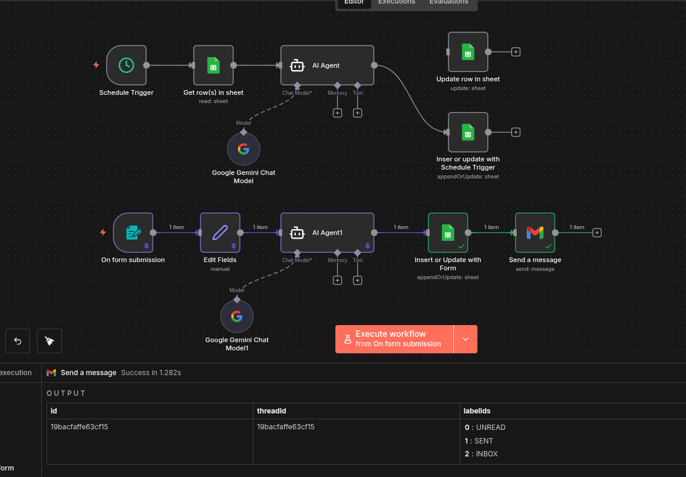

# AI Post Description Automation

Automated workflow untuk generate deskripsi konten menggunakan Google Gemini AI, dengan integrasi Google Sheets dan email notification.



## 🎯 Problem Statement
- Manual content description memakan waktu
- Inconsistent tone dan style
- Butuh scalable solution untuk batch content generation

## 🚀 Solution
Automated workflow dengan 2 input methods:
1. **Schedule Trigger**: Auto-process dari Google Sheets setiap 2 menit
2. **Web Form**: Manual submission dengan email notification

## 🛠 Tech Stack
- n8n workflow automation
- Google Gemini AI (text generation)
- Google Sheets (data storage)
- Gmail (notifications)

## 📊 Results
- Process unlimited topics otomatis
- Generate deskripsi 50-200 kata
- SEO-friendly dan engaging content
- Real-time email delivery

## 🔄 Workflow Flow

**Path 1 - Scheduled:**
```
Schedule → Google Sheets (Read) → AI Agent → Google Sheets (Update)
```

**Path 2 - Web Form:**
```
Form Trigger → Data Mapping → AI Agent → Google Sheets → Gmail
```

## 📝 Key Features
- Customizable description length
- SEO-optimized output
- Batch processing capability
- Email notification system
- Auto-sync dengan Google Sheets

## 🧪 Testing
```bash
# Test via form submission
# Input: Topic, Length, Email
# Output: AI-generated description via email + saved to sheets
```

## 💡 Use Cases
- Content marketing automation
- Social media caption generation
- Blog introduction creation
- SEO meta description

---

**System Message Templates dan detailed prompts tersedia di:** `docs/prompts/`