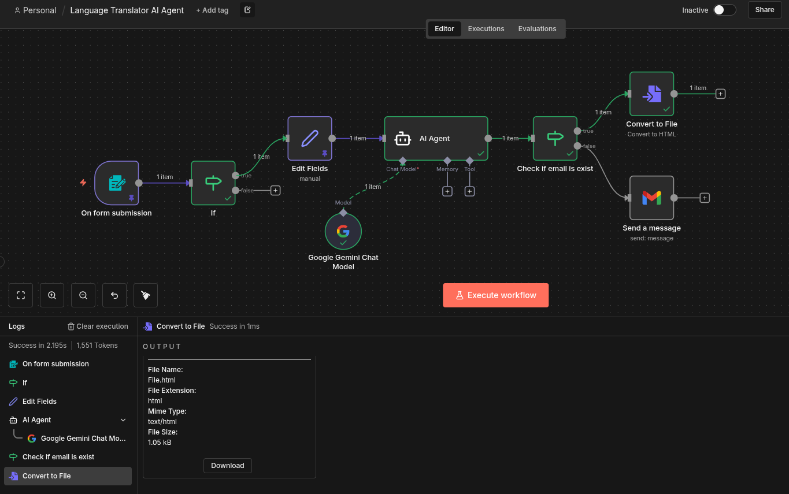

# AI Language Translator Agent

Automated translation service menggunakan Google Gemini AI dengan form submission interface dan email notification support.



## 🎯 Problem Statement
- Manual translation memakan waktu
- Butuh quick translation untuk berbagai bahasa
- Perlu opsi email delivery untuk hasil translation

## 🚀 Solution
AI-powered translation workflow dengan:
1. **Form Input**: User-friendly web form
2. **Multi-language Support**: 5+ bahasa utama
3. **Smart Validation**: Text length dan email checks
4. **Flexible Output**: Direct result atau via email

## 🛠 Tech Stack
- n8n workflow automation
- Google Gemini AI (translation engine)
- Gmail API (email delivery)
- Form Trigger (web interface)

## 📊 Supported Languages
- 🇮🇩 Indonesia
- 🇬🇧 English
- 🇯🇵 Japan
- 🇨🇳 Chinese
- 🇸🇦 Arabic

## 🔄 Workflow Flow

```
Form Submission
    ↓
Validation Check (length > 400 chars)
    ↓
Data Mapping
    ↓
AI Translation (Google Gemini)
    ↓
Email Check
    ├─ Email exists → Send via Gmail
    └─ No email → Convert to File Download
```

## 📝 Key Features

### Input Validation
- Text length check (minimum 400 characters)
- Required fields validation
- Email format verification

### Smart Translation
- Context-aware translation
- Preserves meaning and tone
- Natural language output
- No commentary, clean results

### Flexible Delivery
- **With Email**: Send result via Gmail
- **Without Email**: Download as file
- Instant processing

## 🧪 Form Fields

| Field | Type | Required | Description |
|-------|------|----------|-------------|
| Select Language | Dropdown | Yes | Target translation language |
| Enter a text | Textarea | Yes | Text to translate (min 400 chars) |
| Email (optional) | Text | No | Email for result delivery |

## 💡 Use Cases

1. **Content Translation**
   - Blog posts
   - Documentation
   - Marketing materials

2. **Communication**
   - Business correspondence
   - Customer support
   - Internal memos

3. **Research & Study**
   - Academic papers
   - Technical documents
   - Literature review

## 🎨 Example Usage

### Input:
```
Language: English
Text: "Python telah memantapkan dirinya sebagai bahasa 
pemrograman utama dalam pengembangan Kecerdasan Buatan (AI) 
berkat kombinasi unik dari kesederhanaan, fleksibilitas, 
dan ekosistem perpustakaan yang sangat kaya..."
Email: user@example.com
```

### Output (via Email):
```
Subject: Here your translated text

Python has established itself as the primary programming 
language in Artificial Intelligence (AI) development thanks 
to a unique combination of simplicity, flexibility, and a 
very rich library ecosystem...
```

## ⚙️ Workflow Logic

### Validation Node
```javascript
Checks:
- Text exists
- Language selected
- Text length > 400 characters
```

### Translation Prompt
```
"Translate the following text {input_text} into this 
language {target_language}. Return only the translated 
text, no commentary"
```

### Email Routing
```
If email provided:
  → Send via Gmail
Else:
  → Convert to downloadable file
```

## 📈 Performance

- **Processing Time**: 3-10 seconds
- **Accuracy**: High (powered by Gemini AI)
- **Supported Text Length**: 400+ characters
- **Concurrent Users**: Unlimited (form-based)

## 🔒 Privacy & Security

- No data storage (ephemeral processing)
- Secure API connections
- Email delivery only to provided address
- No credential exposure in workflow

---

**System Message Template tersedia di:** `./AI-Language-Translator-Prompt.txt`